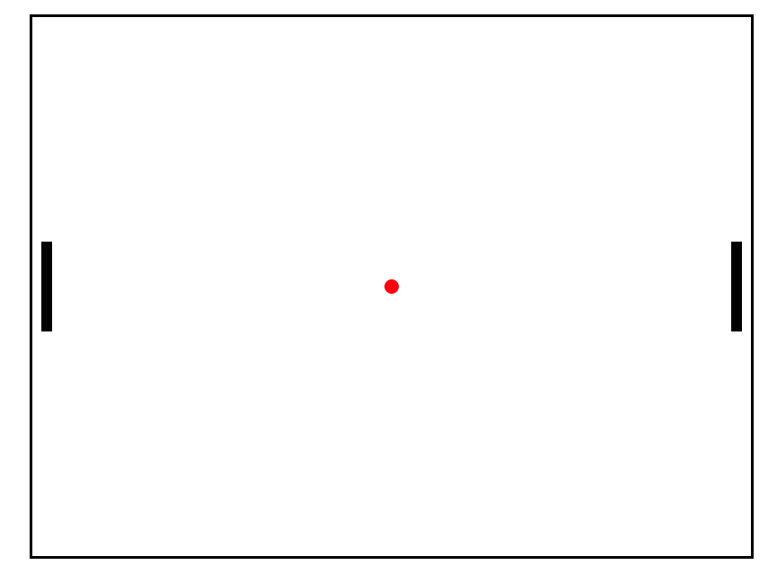

# Ping pong game based on [Phaser](http://phaser.io/) engine

### Controls
 * <b>size [number]</b> - size of the gauge, width = height

### Methods
 * <b>setPointerAngle</b> - function(value), rotates pointer on value degrees from vertical